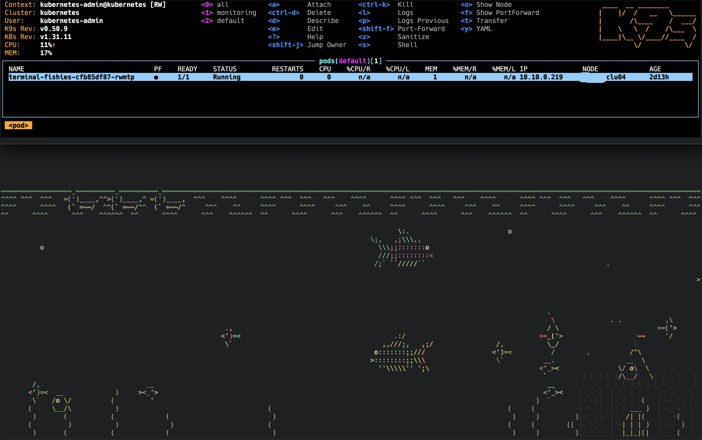

## k8s asciiquarium (a cluster full of fishies)

you can find the original source for the fishies here:
[https://github.com/cmatsuoka/asciiquarium](https://github.com/cmatsuoka/asciiquarium)

### Dockerfile
- the dockerfile build a container, based on the latest ubuntu image that
- create a non-root user `fish` with no password
- copies the fishies script into the user's home directory
- installs essential packages include the perl module `Term::Animation`
- adjusts the `ssh server`configuration to:
    - allow empty password
    - restrict ssh access for user `fish`to only run `/home/fish/fishies`
- prepares the ssh runtime directory
- runs `sshd` in the foreground as the container entrypoint

### build an push the docker image to your registry
```bash
docker build -t docker_image:1.0.0 . -f Dockerfile

docker push docker_image:1.0.0
```

### kubernetes manifests
- **deployment**: runs one replica of the terminal-fishies container with sshd
as the entrypoint. it uses a private registry secret (regcred) to pull the
image.
- **secret**: `create secret generic regcred --from-file=.dockerconfigjson=/home/<your userhome>/.docker/config.json --type=kubernetes.io/dockerconfigjson`
    - this link should also help: [https://kubernetes.io/docs/tasks/configure-pod-container/pull-image-private-registry/](https://kubernetes.io/docs/tasks/configure-pod-container/pull-image-private-registry/)
- **service**: exposes the pod via a NodePort service on port 30288, mapping to
the container’s SSH port (22).

### deploy the docker image to your k8s cluster
```bash
kubectl apply -f k8s-fishies-terminal-deployment.yaml
```

### the funny part

```bash
ssh fish@<node-ip> -p 30288
```


